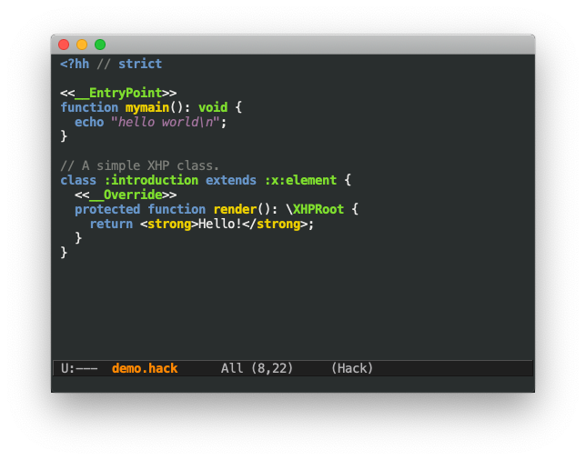

# hack-mode [](http://melpa.org/#/hack-mode) [](https://travis-ci.com/hhvm/hack-mode)

`hack-mode` is an Emacs major mode for editing [Hack](https://hacklang.org/) code.



`hack-mode` provides indentation and extensive syntax
highlighting. This includes:

* Comment highlighting (additionally highlighting special comments
  like `strict`, `HH_FIXME`)
* Keyword highlighting (case insensitive where appropriate)
* String (`'foo', `"foo"`, `<<<FOO` and `<<<'FOO'§) highlighting,
  including interpolation
* XHP support

## Installation

Install from MELPA, or load this package into your elisp load-path.

## Configuration

We recommend using hack-mode with the following minor-modes:

```emacs-lisp
(add-hook 'hack-mode-hook #'lsp-hack-enable)
(add-hook 'hack-mode-hook #'flycheck-mode)
(add-hook 'hack-mode-hook #'company-mode)
```

## .php files

If you have both `hack-mode` and `php-mode` installed, `php-mode` will
be associated with `.php` files. To override this, add the following
configuration:

```emacs-lisp
(add-to-list 'auto-mode-alist '("\\.php\\'" . hack-mode))
```

## License

hack-mode is licensed under the GNU General Public License v3.0.
